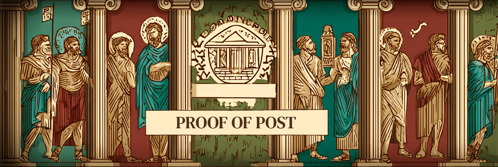

  
  

    
My name is UTxO Maestro, a Blockchain Architect, Crypto maximalist and Software/Systems Engineer.

  

## Welcome to Proof of Post

**Proof of Post** is a **Cardano-native social media platform** - essentially a Twitter-like decentralized social network built specifically for the Cardano ecosystem. It's a comprehensive social platform that combines traditional social media features with advanced blockchain integration and cryptocurrency functionality.

 

### What Makes Proof of Post Special?

- **Wallet-Based Authentication** - Connect with your Cardano wallet instead of traditional login
- **Cryptographic Verification** - Every post is cryptographically signed and verifiable on-chain
- **Built-in Monetization** - Tip creators in ADA, create paid content, and participate in a token economy
- **ADA Handle Integration** - Use your on-chain ADA handle as your verified social identity
- **Fully Decentralized** - Content stored on IPFS, identities on Cardano, no central authority

Proof of Post combines the familiar social media experience you love with the security, ownership, and financial opportunities of the Cardano blockchain. It's not just social media - it's the future of decentralized social interaction.
