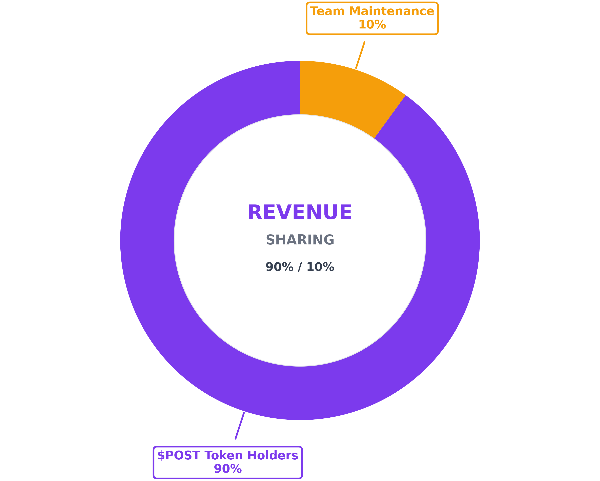

{: style="width: 80px; height: 80px; display: block; margin: 0 auto 20px auto"}

# The $POST Token

The **$POST** token is the native utility token of the **Proof of Post Protocol**, designed to power a revolutionary ecosystem on Cardano. Built with innovative tokenomics and value-accrual mechanisms, $POST serves as the cornerstone of our decentralized platform.

## Token Overview

- **Name**: POST Token  
- **Symbol**: $POST
- **Blockchain**: Cardano
- **Total Supply**: 1 billion
- **Launch**: Check Presale Info

## Core Utility

The $POST tokens grants you revenue sharing in the Proof Of Post network equivalently to owning equity in a business. The revenue that the PoP network is making will be distributed to the token holders of $POST.

## Revenue Sources

The PoP network generates revenue through multiple streams:

- **Swap trading fees** from DexHunter embed on the APP
- **Advertisement fees** 
- **Verification badge fees**
- **Paid content tax**
- **Promoted posts**

## Revenue Distribution

{: style="width: 100%; max-width: 500px; height: auto; display: block; margin: 20px auto"}

### Revenue Allocation:
- **$POST Token Holders**: 90% - Revenue sharing for token holders
- **Team Maintenance**: 10% - Platform development and operations

## Token Distribution

{: style="width: 100%; max-width: 600px; height: auto; display: block; margin: 20px auto"}

### Distribution Breakdown:
- **Presale**: 50% - Early access for initial supporters
- **LP Pool**: 20% - Liquidity and ecosystem development  
- **Top 50 $NADO Holders Airdrop**: 10% - Community rewards
- **Early Users Rewards**: 2.5% - Incentives for platform adoption
- **Treasury Vesting**: 10% - 3-month vesting schedule
- **Liquid Staking Rewards**: 7.5% - 6-month reward program

---

*The $POST token represents ownership in the future of decentralized social media on Cardano. Join us in building the next generation of blockchain applications.*
